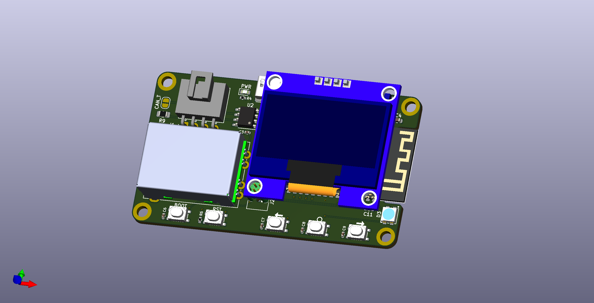

# EltekController

This is a little board I whipped up to connect to my [Eltek Flatpack2 Breakout Board](https://github.com/neg2led/EltekFlatpack2) but it should be useful as a general CANBUS control board with wide voltage input.

Most of the parts on the board are outfitted with their LCSC code for KiKit's JLCPCB SMT fab autogeneration. 

I'm using an ESP32-S2-WROOM / ESP32-S2-WROVER module, abusing the on-board USB DFU to avoid having a USB-UART IC.

There's a header designed to take a cheap AliExpress 1.3" 128x64 OLED module, a Qwiic connector for... reasons? and a footprint that matches ESP-Prog pinout and works with:

- Any 2x3 1.27mm IDC header, shrouded or unshrouded, or appropriate pogopin matrix
- Tag-Connect TC2030-NL programming pogopin connector
- Harwin Gecko 1.25mm pitch wire-to-board connector

There's probably some other stuff that'll fit just fine as well.

The DC-DC converter module is a fancy TDK-Lambda one which I got a whole bunch of from Digikey's Chip Outpost for like 20c each, when I run out I'll probably make another version using either an on-board converter or another module, one that outputs 5V so the Qwiic connector is actually in-spec and the XC6220 isn't solely used for USB-bus-powered mode.

To be honest, expect to see the on-board DC-DC version soon, because this module is C H O N K Y.

I've probably made some really bad design choices here, please don't judge me.

## Repository Structure
- `EltekController` contains the main schematics and board drawing
- `EltekController/EltekController.pretty` contains the board-specific footprints
- `EltekController/shapes3D` contains the 3D models for parts on the board (and a bunch of extras from my various experiments)

## Building
Simply call `make` in the top-top level directory. The `build` directory will then contain:

- the main board
- A panelized version of said board
- zipped gerbers for the boards you can directly use for manufacturing
- zipped gerbers and SMT assembly BOM/position files for JLCPCB's SMT assembly service for the single-board version.

Makefile uses [Jan Mrázek](https://github.com/yaqwsx)'s [KiKit](https://github.com/yaqwsx/KiKit), which I cannot recommend enough, and therefore has to be available on your system.

Jan's [jlcparts](https://yaqwsx.github.io/jlcparts/) app was also extremely useful in narrowing down part choices based on what JLCPCB have available.

-----
### **IMPORTANT NOTE:** If you give JLCPCB these files as-is, *please* verify the orientation of every part before submitting.
